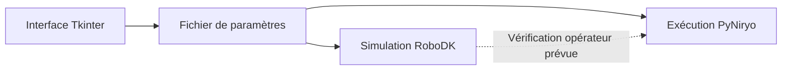

# Niryo Ned2 — du paramétrage à la simulation robotique

**Robotique collaborative · Python · Tkinter · RoboDK · PyNiryo**

Projet de qualification fonctionnelle d'une plateforme robotique collaborative réalisé à **l'INSA Centre Val de Loire**, dans le cadre du cours **EA Systèmes Avancés**.

**Équipe : Alae Zerrouq et Adam Aoubiza** · **Encadrant : Vincent Idasiak**

## Le projet en quelques mots

Concevoir une chaîne de commande pour un bras **Niryo Ned2** : saisir un scénario de manipulation, visualiser les déplacements dans RoboDK, puis préparer leur transposition vers le robot avec PyNiryo. Deux scénarios sont explorés : le **pick-and-place** et l'**empilement / désempilement** appelé « pyramide » dans les scripts.

Ce dépôt rassemble le code académique et les documents du projet. Les scripts de simulation et d'exécution comportent des défauts identifiés ; leur remise en état est nécessaire avant une exécution complète. Le [statut technique](docs/STATUT_TECHNIQUE.md) distingue précisément les éléments disponibles et les limites.

## Compétences mises en pratique

| Compétence | Réalisation dans le dépôt |
|---|---|
| Interface opérateur | Formulaire Tkinter et sérialisation des paramètres |
| Programmation robotique | Séquences de déplacement, saisie, dépose et retour à une pose de référence |
| Simulation hors ligne | Intégration de l'API RoboDK et chargement d'un modèle de robot |
| Intégration matériel / logiciel | Utilisation prévue de PyNiryo, poses et commande de l'outil |
| Transfert simulation-réel | Mise en relation des scénarios simulés et des mouvements physiques |
| Documentation technique | Rapport de projet et fiche de sécurité |

Les contributions sont présentées comme celles de l'équipe ; aucune répartition individuelle non documentée n'est attribuée.

## Architecture prévue



Le passage simulation → réel est une démarche opérateur : le code ne contient pas de mécanisme automatique certifiant qu'une trajectoire a été validée en simulation.

## Explorer le dépôt

```text
├── README.md
├── scripts/
│   ├── ui_parametres.py       # Saisie et sauvegarde des paramètres
│   ├── simulation_robodk.py   # Prototype de simulation
│   ├── execution_robot.py    # Prototype d'exécution, incomplet
│   └── demo_pyramide.py      # Ébauche de démonstration
└── docs/
    ├── README.md             # Index documentaire
    ├── UTILISATION.md        # Prérequis et format des données
    ├── STATUT_TECHNIQUE.md    # Défauts connus et périmètre vérifié
    └── *.pdf                 # Rapport original et fiche de sécurité
```

**Parcours conseillé :** consulter le [rapport](docs/Rapport-Final-S7_Projet-EA-SA_Niryo-Ned2.pdf), lire le [guide d'utilisation](docs/UTILISATION.md), puis explorer les scripts et leur [état technique](docs/STATUT_TECHNIQUE.md).

## Démarrer avec l'interface

L'interface nécessite Python 3 et Tkinter. Depuis la racine du dépôt, dans une session graphique :

```bash
python -m tkinter
python scripts/ui_parametres.py
```

Le premier appel permet de vérifier Tkinter. Le second ouvre le formulaire ; le bouton **Valider** écrit `Données pour Niryo.txt` dans le répertoire courant. La saisie n'est pas validée automatiquement.

RoboDK, son modèle `Niryo-Ned2.robot` et PyNiryo ne sont pas nécessaires pour consulter les documents ou ouvrir ce formulaire. Les prérequis des autres composants sont détaillés dans le guide.

## Documents

- [Rapport final du projet](docs/Rapport-Final-S7_Projet-EA-SA_Niryo-Ned2.pdf)
- [Fiche de sécurité Ned2](docs/FicheDeSecuriteNed2%20%281%29.pdf)

Les scripts historiques sont conservés. Cette réorganisation améliore la documentation ; elle ne constitue pas une validation sur robot ni une correction des algorithmes de mouvement.
